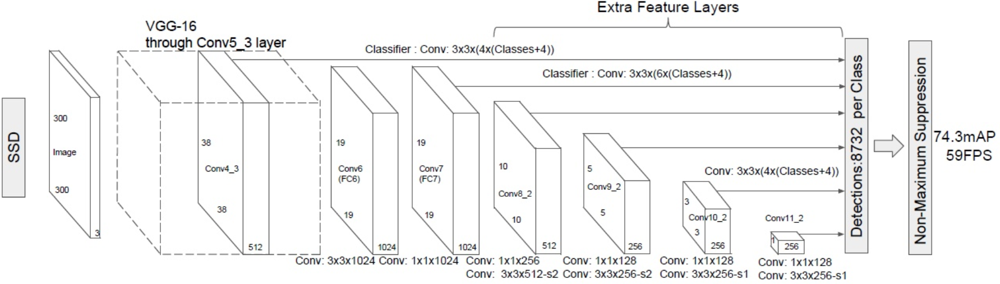

### 简介

&emsp;&emsp;这是一个基于`SSD`和`ResNet`的神经网络模型，将原本`SSD`中的`VGG`部分替换成`ResNet`。该模型可以对危险物品(例如道具、弓箭)进行检测。

&emsp;&emsp;原本`SSD`网络模型结构如下图所示：

使用`ResNet`改进后的架构如下图所示：

&emsp;&emsp;数据集格式采用的是`VOC`格式，数据集在[这里](https://1drv.ms/f/s!AjaVmQ8Qhz4kiDxVFRkgSdmH8AF1)下载，名称是`VOC2009.zip`。